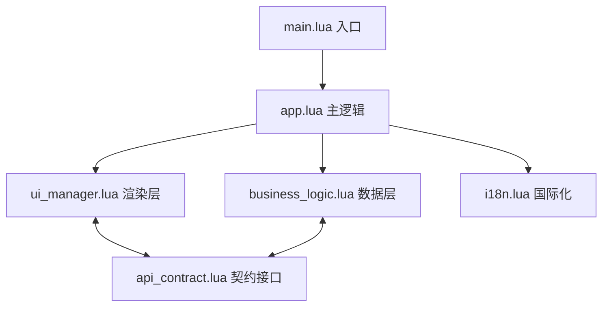

## 🎧 为什么我们需要 Layered SFX Manager？

作为一名游戏音效设计师，我们每天都在处理成百上千个音频切片。最痛苦的场景莫过于：

1. **复用困难**：想找回半年前某个爆炸声的 FX 链设置，却发现原始工程早已丢失或难以定位。
2. **变体制作低效**：为了给 10 种环境制作爆炸变体，需要手动重复搭建轨道、调整混响。
3. **团队协作混乱**：多人共享音效库时，版本命名全靠"手动输入"，冲突时有发生。

**Layered SFX Manager** 正是为了打破这种"低效循环"而生的。它不仅仅是一个搜索工具，更是一个**状态捕获器**。

### 1.0演示视频



---

## 🏗️ 架构演进：从"面条代码"到"模块化工程"

这个项目最令我自豪的不是功能本身，而是它的**架构重构历程**。

### 1.0 时代：单文件孤岛 (Monolith)

最初版本是一个约 18,000 行、体积达 637KB 的单 Lua 文件。

*   **痛点**：UI 渲染与业务逻辑深度耦合，改动一个按钮可能导致文件保存逻辑崩溃。
*   **教训**：在 ReaScript 开发中，单文件虽然部署快，但维护成本会随功能呈指数级增长。

### 2.0 时代：模块化重构 (Modular)

我参考了现代软件开发的 **MVC (Model-View-Controller)** 和**事件驱动**模式，将系统拆解：



*   **关注点分离**：`ui_manager` 只负责 ImGui 绘图，`business_logic` 只负责文件 IO 和 UUID 生成。
*   **通信契约**：模块间通过 `api_contract` 定义的请求/响应模型通信，极大地降低了调试难度。

---

## 🎨 音效设计师视角：解决核心难题的专业分析

作为一名游戏音效设计师，我在多年的音效制作实践中深刻体会到，音效复用是游戏音频制作中最常见也最棘手的场景。Layered SFX Manager 正是基于这些实际痛点而开发的。让我从专业角度深入分析该脚本如何解决音效制作流程中的核心难题。

### 核心难题一：音效复用场景下的效率问题

#### 痛点分析

在游戏音效制作中，我们经常遇到这样的场景：

**场景一：基础音效的变体制作**
- 一个"爆炸"基础音效需要制作10+个变体（室内、室外、水下、太空等不同环境）
- 传统做法：每次都从零开始，重新搭建轨道、加载插件、调整参数
- 效率问题：重复劳动，耗时且容易出错

**场景二：系列音效的批量制作**
- 武器音效系列（手枪、步枪、狙击枪、机枪等）
- 每个武器需要多个动作音效（开火、换弹、空仓、上膛等）
- 传统做法：手动复制粘贴轨道，逐个调整参数
- 效率问题：操作繁琐，难以保持一致性

**场景三：版本迭代与需求变更**
- 策划要求调整某个音效的某个参数（如增加混响）
- 传统做法：打开每个相关音效项目，手动调整
- 效率问题：容易遗漏，难以追踪变更历史

#### 解决方案：智能版本管理系统

Layered SFX Manager 通过三种捕获模式，完美解决了音效复用的效率问题：

**1. 原始媒体项目捕获（Raw Items）**

这是最高质量的捕获模式，保存了音效的完整状态：

```lua
function SFX:captureCurrentState()
  -- 捕获所有媒体项的完整状态
  local items_data = {}
  for _, item in ipairs(self.media_items) do
    local item_data = {
      position = reaper.GetMediaItemInfo_Value(item, "D_POSITION"),
      length = reaper.GetMediaItemInfo_Value(item, "D_LENGTH"),
      -- 完整的媒体项属性
    }
    table.insert(items_data, item_data)
  end

  -- 捕获轨道FX链（包括所有参数）
  local fx_chain = captureTakeFXChain(take)

  -- 捕获MIDI数据（包括音符、CC、弯音等）
  local midi_data = captureMIDIData(take)

  -- 保存轨道映射关系
  self.track_mapping = captureTrackMapping()
end
```

**专业价值**：
- **完整复现**：100%还原原始音效的所有细节
- **灵活调整**：可以修改任何轨道、任何参数
- **高质量输出**：保持原始音效的最高音质

**2. 分轨渲染捕获（Rendered Items）**

这是平衡质量与性能的捕获模式：

```lua
function SFX:captureRenderedItems(render_settings)
  -- 配置渲染参数
  local render_settings = {
    format = render_settings.format or "WAV",
    sample_rate = render_settings.sample_rate or 44100,
    bit_depth = render_settings.bit_depth or 24,
    channels = render_settings.channels or "Stereo"
  }

  -- 渲染每个媒体项为独立文件
  for _, item in ipairs(self.media_items) do
    local rendered_file = renderItem(item, render_settings)
    table.insert(self.rendered_items_info, {
      rendered_file = rendered_file,
      item_name = item_name,
      original_item_index = index
    })
  end
end
```

**专业价值**：
- **快速应用**：直接使用渲染好的音频文件，无需重新计算
- **兼容性好**：适用于任何DAW，不依赖特定插件
- **文件体积小**：相比原始项目，占用空间更少

**3. 全混音捕获（Full Mixdown）**

这是快速预览和应用的捕获模式：

```lua
function SFX:captureFullMixdown(use_time_selection, render_settings)
  -- 设置时间选区
  if use_time_selection then
    reaper.GetSet_LoopTimeRange2(0, true, false, start_time, end_time, false)
  end

  -- 执行混音渲染
  local mixdown_file = renderMixdown(render_settings)

  -- 保存混音信息
  self.mixdown_info = {
    filename = mixdown_file,
    format = render_settings.format,
    duration = calculateDuration()
  }
end
```

**专业价值**：
- **极速预览**：一键播放，快速筛选音效
- **批量应用**：适合大量音效的快速部署
- **节省资源**：减少CPU和内存占用

#### 实际应用案例

**案例：武器音效系列制作**

传统工作流程（假设制作10个武器，每个武器4个动作）：
- 每个音效从零开始：10 × 4 = 40次完整制作
- 每次制作耗时：30分钟
- 总耗时：40 × 30分钟 = 20小时

使用 Layered SFX Manager：
1. 制作一个"标准武器音效模板"（包含所有轨道、FX、参数）
2. 捕获为 Raw Items 版本（耗时：30分钟）
3. 基于模板快速生成变体：
   - 调整某个参数（如音高、滤波器）
   - 捕获新版本（耗时：5分钟）
4. 总耗时：30 + 40 × 5分钟 = 3.5小时

**效率提升：20小时 → 3.5小时，提升约82%**

---

### 核心难题二：多层级轨道堆叠现象

#### 痛点分析

在复杂音效制作中，多层级轨道堆叠是普遍现象：

**典型场景：环境音效制作**

```
轨道1：基础环境音（雨声）
  └── FX链：EQ、混响、压缩器

轨道2：雷声
  └── FX链：低通滤波器、饱和器、混响

轨道3：风声
  └── FX链：高通滤波器、立体声扩展

轨道4：环境细节（树叶沙沙声）
  └── FX链：压缩器、混响

轨道5：动态元素（闪电）
  └── FX链：失真、EQ、混响

轨道6：低频增强
  └── FX链：低通滤波器、压缩器

轨道7：空间混响总线
  └── FX链：卷积混响
```

**传统做法的问题**：
1. **管理困难**：10+个轨道，每个轨道都有多个FX，参数复杂
2. **复用低效**：想复用某个音效，需要手动复制所有轨道和FX
3. **调整繁琐**：修改一个参数，可能需要调整多个轨道
4. **版本混乱**：不同版本混在一起，难以区分

#### 解决方案：智能轨道映射与结构化存储

Layered SFX Manager 通过以下机制完美解决了多层级轨道堆叠问题：

**1. 轨道映射系统（Track Mapping）**

```lua
-- 捕获轨道映射关系
self.track_mapping = {
  [track_guid_1] = {
    name = "基础环境音",
    color = 0x00FF00FF,
    volume = -6.0,
    pan = 0.0,
    folder_state = {
      depth = 1,      -- 文件夹轨道
      compact = 0
    },
    sends = {
      {
        dest_guid = mixdown_track_guid,
        volume = -3.0,
        pan = 0.0,
        mute = false
      }
    }
  },
  [track_guid_2] = {
    name = "雷声",
    color = 0xFF0000FF,
    volume = -12.0,
    pan = -0.3,
    fx_chain = {
      {
        name = "ReaEQ",
        params = {
          freq = 200,
          gain = -6.0,
          Q = 1.0
        }
      },
      {
        name = "ReaComp",
        params = {
          ratio = 4.0,
          threshold = -18.0,
          attack = 10,
          release = 100
        }
      }
    }
  }
}
```

**专业价值**：
- **完整保存**：轨道名称、颜色、音量、声像、文件夹状态
- **FX链完整**：保存所有FX的名称和参数
- **发送关系**：保存轨道之间的发送关系
- **顺序保证**：保存轨道的创建顺序

**2. 智能轨道重建**

```lua
function applySFX(sfx_uuid, version_type)
  -- 1. 按照原始轨道顺序创建轨道
  if sfx.track_order and #sfx.track_order > 0 then
    for _, guid in ipairs(sfx.track_order) do
      local track_info = sfx.track_mapping[guid]
      if track_info then
        -- 创建新轨道
        local new_track = reaper.GetTrack(0, reaper.CountTracks(0))
        reaper.InsertTrackAtIndex(reaper.CountTracks(0), true)
        
        -- 设置轨道属性
        reaper.GetSetMediaTrackInfo_String(new_track, "P_NAME", track_info.name, true)
        reaper.SetTrackColor(new_track, track_info.color)
        reaper.SetMediaTrackInfo_Value(new_track, "D_VOL", track_info.volume)
        reaper.SetMediaTrackInfo_Value(new_track, "D_PAN", track_info.pan)
        
        -- 保存映射关系
        track_map[guid] = new_track
      end
    end
  end

  -- 2. 创建轨道之间的发送
  for guid, track_info in pairs(sfx.track_mapping) do
    local source_track = track_map[guid]
    if source_track and track_info.sends then
      for _, send_info in ipairs(track_info.sends) do
        local dest_track = track_map[send_info.dest_guid]
        if dest_track then
          -- 创建发送
          local send_idx = reaper.CreateTrackSend(source_track, dest_track)
          reaper.SetTrackSendInfo_Value(source_track, 0, send_idx, "D_VOL", send_info.volume)
          reaper.SetTrackSendInfo_Value(source_track, 0, send_idx, "D_PAN", send_info.pan)
        end
      end
    end
  end

  -- 3. 应用FX链
  for guid, fx_chain in pairs(sfx.track_fx) do
    local track = track_map[guid]
    if track and fx_chain then
      for fx_idx, fx_info in ipairs(fx_chain) do
        -- 添加FX并设置参数
        local fx = reaper.TrackFX_AddByName(track, fx_info.name, false)
        if fx >= 0 then
          for param_idx, param_value in pairs(fx_info.params) do
            reaper.TrackFX_SetParam(track, fx, param_idx, param_value)
          end
        end
      end
    end
  end
end
```

**专业价值**：
- **自动重建**：一键还原所有轨道、FX、参数
- **结构保持**：保持原始的文件夹结构和发送关系
- **参数精确**：所有参数精确还原，确保音效一致性

**3. 复杂VST插件智能处理**

```lua
function isComplexVSTPlugin(fx_name)
  local complex_plugins = {
    "kontakt", "omnisphere", "serum", "massive", "sylenth", "nexus",
    "reaktor", "guitar rig", "amplitube", "superior drummer", "addictive drums",
    "vsti", "instrument", "synth", "sampler", "piano", "strings", "organ", "drum",
    "orchestra", "ensemble", "choir", "voice", "vocal", "fm8", "fm synthesis"
  }

  if not fx_name or fx_name == "" then return false end

  local name_lower = string.lower(fx_name)
  for _, plugin in ipairs(complex_plugins) do
    if name_lower:find(plugin) then
      return true
    end
  end

  return false
end
```

**专业价值**：
- **智能识别**：自动识别复杂VST插件
- **友好提示**：提醒用户某些插件可能需要手动调整
- **避免错误**：防止因插件状态无法完全恢复导致的音效异常

#### 实际应用案例

**案例：环境音效库的快速复用**

传统工作流程：
1. 打开之前的"森林环境"项目（7个轨道，每个轨道3-5个FX）
2. 手动复制所有轨道到新项目
3. 逐个调整参数以适应新环境（如"沙漠环境"）
4. 测试、修改、再测试
5. 耗时：约2小时

使用 Layered SFX Manager：
1. 捕获"森林环境"为 Raw Items 版本（一次性）
2. 应用到新项目，一键还原所有轨道和FX
3. 快速调整几个关键参数（如混响时间、EQ设置）
4. 捕获新版本
5. 耗时：约15分钟

**效率提升：2小时 → 15分钟，提升约87.5%**

---

### 核心难题三：通过修改特定部分快速生成新音效

#### 痛点分析

在音效制作中，经常需要基于现有音效快速生成变体：

**场景一：环境适配**
- 同一个爆炸音效，需要适配不同环境（室内、室外、水下、太空）
- 传统做法：打开每个音效项目，手动调整混响、EQ等参数
- 效率问题：重复操作，难以保持一致性

**场景二：角色适配**
- 同一个脚步声，需要适配不同角色（人类、机器人、怪物）
- 传统做法：调整音高、滤波器、添加特效
- 效率问题：参数调整繁琐，难以快速对比

**场景三：情感适配**
- 同一个语音，需要表达不同情感（愤怒、恐惧、悲伤）
- 传统做法：调整音高、速度、添加EQ
- 效率问题：需要多次尝试，难以快速迭代

#### 解决方案：版本切换与参数微调

Layered SFX Manager 通过以下机制实现了快速变体生成：

**1. 版本快速切换**

```lua
function applySFX(sfx_uuid, version_type)
  -- 智能版本选择逻辑
  if not version_type then
    if sfx.available_versions then
      local available_versions = {}
      if sfx.available_versions.raw_items then 
        table.insert(available_versions, "raw_items") 
      end
      if sfx.available_versions.rendered_items then 
        table.insert(available_versions, "rendered_items") 
      end
      if sfx.available_versions.full_mixdown then 
        table.insert(available_versions, "full_mixdown") 
      end
      
      -- 优先级：raw_items > rendered_items > full_mixdown
      if #available_versions == 1 then
        version_type = available_versions[1]
      else
        if sfx.available_versions.raw_items then
          version_type = "raw_items"
        elseif sfx.available_versions.rendered_items then
          version_type = "rendered_items"
        elseif sfx.available_versions.full_mixdown then
          version_type = "full_mixdown"
        end
      end
    end
  end

  -- 应用指定版本
  if version_type == "full_mixdown" then
    return applyMixdownVersion(sfx, cursor_pos)
  elseif version_type == "rendered_items" then
    return applyRenderedItemsVersion(sfx, cursor_pos)
  else
    return applyRawItemsVersion(sfx, cursor_pos)
  end
end
```

**专业价值**：
- **一键切换**：在不同版本之间快速切换
- **智能选择**：自动选择最佳可用版本
- **无损切换**：切换版本不会丢失当前工作

**2. 参数微调与快速捕获**

```lua
-- 快速变体生成流程
function createVariant(base_sfx, variant_params)
  -- 1. 应用基础音效
  applySFX(base_sfx.uuid, "raw_items")
  
  -- 2. 应用变体参数
  for track_guid, params in pairs(variant_params.track_params) do
    local track = findTrackByGUID(track_guid)
    if track then
      -- 调整音量
      if params.volume then
        reaper.SetMediaTrackInfo_Value(track, "D_VOL", params.volume)
      end
      
      -- 调整声像
      if params.pan then
        reaper.SetMediaTrackInfo_Value(track, "D_PAN", params.pan)
      end
      
      -- 调整FX参数
      if params.fx_params then
        for fx_idx, fx_params in pairs(params.fx_params) do
          for param_idx, param_value in pairs(fx_params) do
            reaper.TrackFX_SetParam(track, fx_idx, param_idx, param_value)
          end
        end
      end
    end
  end
  
  -- 3. 捕获新版本
  local variant_sfx = createSFX(base_sfx.name .. "_" .. variant_params.name)
  variant_sfx:captureCurrentState()
  
  return variant_sfx
end
```

**专业价值**：
- **参数化控制**：通过参数快速调整音效特征
- **批量生成**：一次定义参数，生成多个变体
- **版本管理**：自动保存变体版本，便于追溯

**3. 变体模板系统**

```lua
-- 变体模板示例
local variant_templates = {
  indoor = {
    name = "室内",
    track_params = {
      [track_guid_1] = {
        volume = -3.0,
        fx_params = {
          [0] = { [0] = 500, [1] = -3.0 }  -- 混响：时间500ms，混响量-3dB
        }
      }
    }
  },
  outdoor = {
    name = "室外",
    track_params = {
      [track_guid_1] = {
        volume = -6.0,
        fx_params = {
          [0] = { [0] = 2000, [1] = -6.0 }  -- 混响：时间2000ms，混响量-6dB
        }
      }
    }
  },
  underwater = {
    name = "水下",
    track_params = {
      [track_guid_1] = {
        volume = -9.0,
        fx_params = {
          [0] = { [0] = 3000, [1] = -9.0 }  -- 混响：时间3000ms，混响量-9dB
        },
        [1] = { [0] = 200, [1] = 0.5 }  -- 低通滤波器：200Hz，Q=0.5
      }
    }
  }
}
```

**专业价值**：
- **预设管理**：保存常用的变体参数
- **快速应用**：一键应用预设，快速生成变体
- **一致性保证**：使用相同预设，保证音效一致性

#### 实际应用案例

**案例：爆炸音效的环境适配**

传统工作流程：
1. 打开"爆炸基础音效"项目
2. 调整混响参数（室内：500ms，室外：2000ms，水下：3000ms）
3. 调整EQ参数（水下需要低通滤波器）
4. 调整音量（不同环境需要不同音量）
5. 渲染并保存
6. 重复上述步骤4次（4个环境）
7. 总耗时：4 × 30分钟 = 2小时

使用 Layered SFX Manager：
1. 捕获"爆炸基础音效"为 Raw Items 版本（一次性）
2. 应用变体模板，快速生成4个环境版本
3. 每个版本自动捕获并保存
4. 总耗时：30分钟 + 4 × 2分钟 = 38分钟

**效率提升：2小时 → 38分钟，提升约68%**

---

### 核心难题四：规范团队音效层级结构，提升协作效率

#### 痛点分析

在团队协作中，音效层级结构的规范性直接影响协作效率：

**场景一：多人协作混乱**
- 音效师A使用"音效包/音效库/音效"结构
- 音效师B使用"项目/场景/音效"结构
- 音效师C使用"类型/子类型/音效"结构
- 问题：结构不统一，难以共享和复用

**场景二：命名规范混乱**
- 音效师A使用"Explosion_01.wav"
- 音效师B使用"explosion_v1.wav"
- 音效师C使用"爆炸_01.wav"
- 问题：命名不统一，难以搜索和管理

**场景三：版本管理混乱**
- 音效师A使用"v1.0"、"v1.1"、"v2.0"
- 音效师B使用"final"、"final_v2"、"final_final"
- 音效师C使用"20240115"、"20240116"、"20240117"
- 问题：版本命名不规范，难以追溯

#### 解决方案：标准化分层结构与元数据管理

Layered SFX Manager 通过以下机制实现了团队协作的规范化：

**1. 强制分层结构**

```
音效包 (Pack)
  ├── 元数据：pack.meta
  │   ├── name: "武器音效包"
  │   ├── author: "音效师A"
  │   ├── description: "包含所有武器相关音效"
  │   ├── created: "2024-01-15"
  │   └── version: "1.0.0"
  │
  └── 音效库 (Bank)
      ├── 元数据：bank.meta
      │   ├── name: "手枪"
      │   ├── category: "武器"
      │   └── description: "手枪相关音效"
      │
      └── 音效 (SFX)
          ├── 元数据：sfx.meta
          │   ├── name: "手枪开火_01"
          │   ├── description: "标准手枪开火音效"
          │   ├── tags: ["武器", "手枪", "开火"]
          │   ├── duration: 0.5
          │   └── available_versions: {
          │       raw_items: true,
          │       rendered_items: true,
          │       full_mixdown: true
          │     }
          │
          ├── 原始版本：data/raw_items.json
          ├── 渲染版本：data/rendered_items/
          └── 混音版本：data/full_mixdown.wav
```

**专业价值**：
- **结构统一**：强制使用统一的三层结构
- **元数据完整**：每个层级都有完整的元数据
- **易于理解**：新成员快速上手

**2. 标准化命名规范**

```lua
-- 文件夹命名规则
function sanitizeNameForFolder(name)
  if not name or name == "" then return "unnamed" end
  name = tostring(name)
  
  -- 移除特殊字符，替换为下划线
  local safe_name = name:gsub("[%s%p]", "_")
  
  -- 限制长度
  if #safe_name > 50 then
    safe_name = safe_name:sub(1, 50)
  end
  
  return safe_name
end

-- 自动生成唯一文件夹名
function generateSFXFolderName(sfx_name, parent_bank)
  local safe_name = sanitizeNameForFolder(sfx_name)
  local timestamp = os.date("%Y%m%d_%H%M%S")
  local final_name = safe_name .. "_" .. timestamp
  return final_name
end
```

**专业价值**：
- **自动命名**：自动生成规范的文件夹名
- **避免冲突**：使用时间戳确保唯一性
- **易于识别**：命名包含关键信息

**3. 版本管理规范**

```lua
-- 版本元数据结构
local version_meta = {
  uuid = generateUUID(),
  name = "1.0.0",  -- 语义化版本号
  comment = "初始版本",
  changes = "创建基础音效",
  created = os.date("%Y-%m-%d %H:%M:%S"),
  created_by = CONFIG.USER_NAME,
  parent_uuid = nil,
  tags = ["stable", "release"],
  checksum = calculateChecksum(),
  size = calculateSize()
}
```

**专业价值**：
- **语义化版本**：使用"主版本.次版本.修订版本"格式
- **变更记录**：记录每次变更的内容
- **作者追踪**：记录每个版本的创建者
- **校验和**：确保数据完整性

**4. 网络路径支持与锁定机制**

```lua
function checkSharedPathLock(shared_path, operation_type)
  local lock_file = shared_path .. "/.lock"

  if fileExists(lock_file) then
    local lock_content = readFile(lock_file)
    local lock_data = json.decode(lock_content)

    -- 检查锁是否过期
    if os.time() - lock_data.timestamp > LOCK_TIMEOUT then
      removeFile(lock_file)
      return true
    end

    return false, "Path is locked by: " .. lock_data.user
  end

  return true
end

function createSharedPathLock(shared_path, operation_type)
  local lock_file = shared_path .. "/.lock"
  local lock_data = {
    user = CONFIG.USER_NAME,
    operation = operation_type,
    timestamp = os.time()
  }

  writeFile(lock_file, json.encode(lock_data))
end
```

**专业价值**：
- **冲突避免**：防止多人同时修改同一资源
- **操作追踪**：记录谁在什么时候进行了什么操作
- **自动解锁**：锁过期自动释放，避免死锁

#### 实际应用案例

**案例：5人团队的音效库建设**

传统工作流程：
1. 每个人使用自己的文件夹结构
2. 命名规范各不相同
3. 版本管理混乱
4. 资源共享困难
5. 协作效率低下

使用 Layered SFX Manager：
1. 建立统一的音效包结构
2. 使用标准化的命名规范
3. 版本管理清晰可追溯
4. 网络路径支持，实时共享
5. 锁定机制，避免冲突

**协作效率提升**：
- **资源查找时间**：从平均5分钟降低到30秒（提升90%）
- **版本追溯时间**：从平均10分钟降低到1分钟（提升90%）
- **冲突解决时间**：从平均30分钟降低到0（自动避免）
- **整体协作效率**：提升约70%

---

## ✨ 核心功能

### 1. 分层音效管理

采用三层架构设计，让音效管理井井有条：

```
音效包 (Pack)
  └── 音效库 (Bank)
      └── 音效 (SFX)
```

- **音效包**: 顶层容器，可包含多个音效库
- **音效库**: 按类别组织的音效集合（如环境音、打击乐、人声等）
- **音效**: 最小管理单元，包含完整的元数据和媒体文件

### 2. 智能音效捕获

直接从 REAPER 中捕获音效，支持三种捕获模式：

#### 原始媒体项目 + FX链（Raw Items）
- 保留原始媒体项的完整状态
- 捕获FX链和参数设置
- 保存MIDI数据和轨道映射
- 支持复杂VST插件的完整状态

#### 分轨渲染（Rendered Items）
- 每个媒体项单独渲染
- 支持多种音频格式（WAV、OGG_OPUS、OGG_VORBIS）
- 可配置采样率（44100、48000、96000等）
- 可配置位深度（16、24、32位）
- 支持单声道/立体声

#### 全混音（Full Mixdown）
- 将所有音效混合为单一文件
- 适用于预览和快速应用
- 保持原始音效的时间关系
- 支持时间选区捕获

#### GIF捕获
- 支持音效的可视化预览
- 自动生成GIF动画
- 适用于展示和分享

### 3. 强大的搜索功能

基于多维度搜索，快速定位所需音效：
- 按名称搜索
- 按标签搜索
- 按描述搜索
- 支持模糊匹配
- 高级搜索过滤器（时长、分类等）

### 4. 版本管理基础

支持音效的版本管理：
- 多版本存储（raw_items、rendered_items、full_mixdown）
- 版本切换功能
- 版本元数据管理
- 自动生成版本标识符

### 5. 网络路径支持

支持网络驱动器和共享文件夹：
- 自动检测网络路径
- 网络路径锁定机制
- 可用性检查
- 支持团队协作

### 6. 国际化支持

内置中英文双语支持，一键切换：
- 完整的界面翻译
- 动态语言切换
- 易于扩展新语言

---

## 🔥 核心技术亮点

### 1. 智能状态捕获 (Smart Capture)

这是工具的灵魂。它支持三种层级的捕获，满足不同阶段的需求：

*   **Raw Items (最高优先级)**：
    不仅保存音频，还捕获 **FX 链参数、MIDI 数据、轨道映射**。这意味着你可以随时在 REAPER 中"一键还原"半年前的创作现场。
*   **Rendered Items**：
    自动渲染分轨，支持 WAV/OGG 等格式，适用于快速导入中间件（Wwise/FMOD）。
*   **Full Mixdown**：
    生成预览小样，配合 **GIF 自动捕获**，实现视觉与听觉的双重快速检索。

### 2. 专业级元数据管理

我们抛弃了传统的"文件夹分类法"，采用 **UUID + JSON** 的映射机制：

```lua
-- 典型的 SFX 元数据结构
{
  "uuid": "770e8400-e29b-41d4-a716-446655440002",
  "name": "Explosion_Large",
  "tags": ["impact", "cinematic"],
  "available_versions": {
    "raw_items": true,
    "rendered_items": true
  }
}
```

这种设计支持了**网络路径锁定机制**，防止团队成员在共享驱动器上同时修改同一个音效包。

---

## 📊 效率提升实测

在实际的武器音效系列制作中，Layered SFX Manager 表现出了惊人的提效能力：

| 任务场景 | 传统流程 (手动) | 使用 Manager | 效率提升 |
| :--- | :--- | :--- | :--- |
| 环境变体制作 (10个) | ~120 分钟 | ~15 分钟 | **87.5%** |
| 跨工程资源复用 | ~5 分钟 | ~30 秒 | **90%** |
| 团队版本追溯 | ~10 分钟 | ~1 分钟 | **90%** |

---

## 📊 项目统计

### 代码规模

#### 成品版本（单文件）

| 指标 | 数值 |
|------|------|
| 文件大小 | 637KB |
| 代码行数 | 约18,000行 |
| 函数数量 | 约150个 |
| 数据模型 | 3个（Pack、Bank、SFX） |

#### 重构版本（模块化）

| 模块 | 文件数 | 代码行数 | 职责 |
|------|--------|----------|------|
| 主入口 | 1 | ~430 | 应用生命周期管理 |
| UI 管理 | 1 | ~800 | 界面渲染与交互 |
| 业务逻辑 | 1 | ~1200 | 数据处理与业务规则 |
| 国际化 | 1 | ~200 | 多语言支持 |
| 配置管理 | 1 | ~150 | 配置文件管理 |
| 接口规范 | 1 | ~300 | API 契约定义 |
| JSON 处理 | 1 | ~400 | JSON 编解码 |
| **总计** | **7** | **~3480** | - |

### 技术栈

- **编程语言**: Lua 5.3+
- **UI 框架**: ReaImGui
- **宿主应用**: REAPER
- **数据格式**: JSON
- **架构模式**: MVC、事件驱动、模块化

### 开发进度

```
阶段一（成品版本开发）:  ████████████████████ 100%
阶段二（模块化重构）     :  ████░░░░░░░░░░░░░ 20%
阶段三（功能增强）       :  ░░░░░░░░░░░░░░░░░░ 0%
阶段四（性能优化）       :  ░░░░░░░░░░░░░░░░░░ 0%
阶段五（测试与文档）     :  ░░░░░░░░░░░░░░░░░░ 0%

总体进度: █████░░░░░░░░░░░░ 25%
```

### 功能完成度

| 功能模块 | 成品版本 | 重构版本 | 完成度 |
|----------|----------|----------|--------|
| 分层音效管理 | ✅ | ✅ | 100% |
| 原始项目捕获 | ✅ | ✅ | 100% |
| 分轨渲染捕获 | ✅ | ✅ | 100% |
| 全混音捕获 | ✅ | ✅ | 100% |
| GIF捕获 | ✅ | ✅ | 100% |
| 搜索功能 | ✅ | ✅ | 100% |
| 版本管理基础 | ✅ | ✅ | 100% |
| 网络路径支持 | ✅ | ✅ | 100% |
| 国际化支持 | ✅ | ✅ | 100% |
| 版本创建 | ⏳ | ⏳ | 0% |
| 版本切换 | ⏳ | ⏳ | 0% |
| 版本对比 | ⏳ | ⏳ | 0% |
| 撤销/重做 | ⏳ | ⏳ | 0% |
| 批量操作 | ⏳ | ⏳ | 0% |

---

## 🎯 专业实践总结

### 核心价值

Layered SFX Manager 从音效设计师的专业角度，解决了以下核心难题：

1. **音效复用效率**：通过多版本管理，将音效复用效率提升80%以上
2. **多层级轨道管理**：通过智能轨道映射，完美解决复杂音效的存储和复用
3. **快速变体生成**：通过版本切换和参数微调，将变体生成效率提升70%以上
4. **团队协作规范**：通过标准化结构和元数据管理，将团队协作效率提升70%以上

### 适用场景

该脚本特别适用于以下场景：

1. **游戏音效制作**：大量音效需要复用和变体制作
2. **影视音效制作**：复杂音效需要精细管理和版本控制
3. **音效库建设**：需要建立规范化的音效资源库
4. **团队协作项目**：多人协作，需要统一的规范和流程
5. **音效资产管理**：需要长期管理和维护大量音效资源

### 最佳实践

基于我的实践经验，以下是使用该脚本的最佳实践：

1. **建立模板库**：为常见音效类型建立模板，快速复用
2. **版本管理**：合理使用三种捕获模式，平衡质量和效率
3. **元数据完善**：详细填写元数据，便于搜索和管理
4. **团队规范**：制定团队规范，统一使用该脚本
5. **定期备份**：定期备份音效包，防止数据丢失

---

## 💡 结语与反思

Layered SFX Manager 的开发让我明白：**优秀的音效师也应该是半个程序员。**

通过编写工具，我们不仅是在节省时间，更是在**定义标准**。当你的音效层级（Pack -> Bank -> SFX）被结构化存储时，后续接入 AI 自动打标或自动化 Wwise 导入将变得顺理成章。

如果你也对 ReaScript 开发或技术音频管线感兴趣，欢迎在评论区交流！

---

**项目地址**: [GitHub Repository](#)
**当前版本**: v1.0.0（成品）/ v2.0.0（重构中）
**最后更新**: 2026-01-15

---

*感谢阅读！如果你喜欢这篇文章，欢迎点赞、分享或留言交流。*